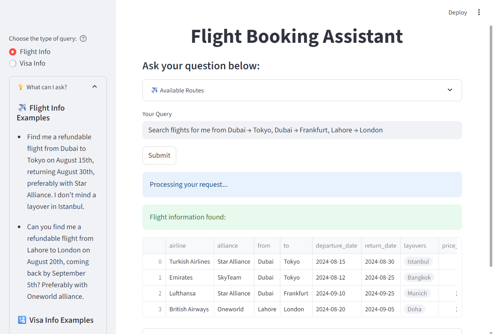

# Conversational Flight Assistant

[](https://www.python.org/)
[](https://www.langchain.com/)
[](https://streamlit.io/)
[](https://github.com/facebookresearch/faiss)
[](https://www.promptingguide.ai/techniques/rag)
[](https://code.visualstudio.com/)
---

A modular travel assistant built with **LangChain**, **Streamlit**, and **RAG** to handle flight and visa-related queries in natural language. This repository is continuously updated with experiments and improvements.


---

## Features

- Understand flight queries with natural language input.
- Search mock flights using filters: stops, class, price, dates.
- Answer visa and refund questions using a local knowledge base.
- Powered by OpenAI, LangChain tools, and FAISS vector database.
---

## Quickstart

Clone the repository:

```bash
git clone https://github.com/your-username/conversational-travel-assistant.git
cd conversational-travel-assistant
```

### Install dependencies:
```
pip install -r requirements.txt
```

## Setup OpenAI API Key
Add your OpenAI API key in .env:
```OPENAI_API_KEY=your-api-key-here```

## Build FAISS Vector Store
The knowledge base lives in:

```data/visa_rules.md```

To build the vector store, set:

```STORE_DATA = True```


Then run:

```python main.py```


The index will be saved in `paiss_index/`.

## Launch Streamlit UI

```streamlit run app.py```


Ask questions such as:

` "Do I need a visa to travel from UAE to Japan?"
- "What’s the refund policy for business class flights?"

Project Structure
```
conversational-travel-assistant/
├── app.py               # Streamlit UI
├── main.py              # CLI entry point
├── agent/               # LangChain tools (aviationstack, visaDB)
├── data/                # flights.json, visa_rules.md
├── flight_search/       # Custom search filters
├── utils/               # RAG helpers, formatters
├── images/              # UI screenshots
└── Readme.md
```

## Notes & Limitations
- Prototype only — UI/UX and API integrations are WIP.
- Requires OpenAI API key.
- Uses mock flight data; no real-time API calls.
- Answers generated with simple context-RAG; no memory.

## Next Steps
- Integrate AviationStack & Visa APIs.
- Add file upload for custom documents.
- Enable multi-turn memory (LangGraph).
- Docker support and cloud deployment.
- Add observability and logging.
---
<br>

**Author:** Aroosh Ahmad — AI Engineer (NLP, LLMs, ML Systems) &nbsp;&nbsp;&nbsp;&nbsp;&nbsp;&nbsp;&nbsp;&nbsp;&nbsp;&nbsp;&nbsp;&nbsp;[GitHub](https://github.com/arushahmd) • [LinkedIn](https://www.linkedin.com/in/arooshahmad-data/)
